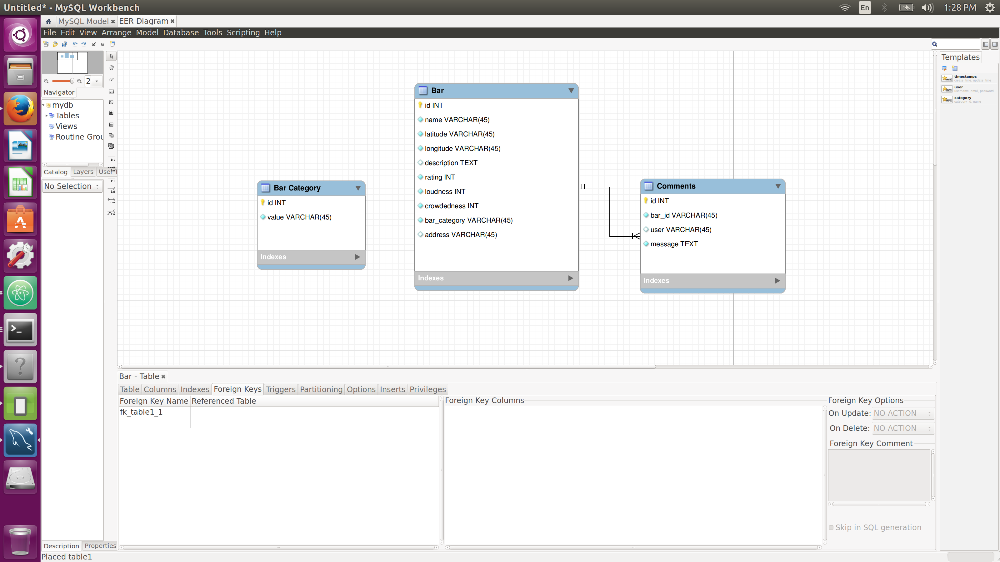

# README

This README would normally document whatever steps are necessary to get the
application up and running.

Things you may want to cover:

* Ruby version

* System dependencies

* Configuration

* Database creation

* Database initialization

* How to run the test suite

* Services (job queues, cache servers, search engines, etc.)

* Deployment instructions

* ...

## API

| Rest Verb | Path   | Params | Param Type | Description   |
|-----------|--------|--------|------------|---------------|
| POST | bars | latitude, longitude | BODY | returns the list of bars within a variance of latitude and logitutde |
| GET | bars-admin | | | returns a list of all bars within the system |
| POST | bars-admin | < all bar parameters > | BODY | adds a bar to the system |
| PUT | bars-admin/{id} | < all bars params > | BODY | updates a bar in the system |
| DELETE | bars-admin/{id} | id | URL | deletes a bar in the system |

## SCHEMA

